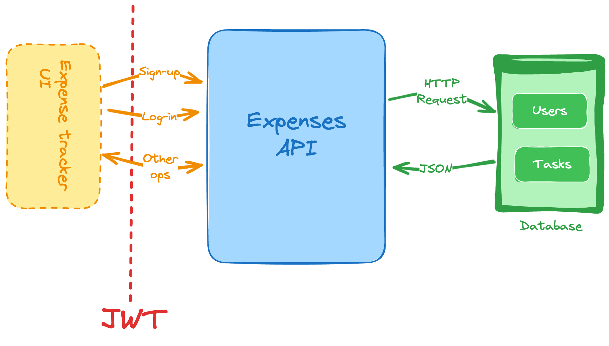

<p align="center">
  
  
  
  
</p>

# Build an API for an expense tracker application.

> Roadmap.sh project link > https://roadmap.sh/projects/expense-tracker-api 

Build an API for an expense tracker application. **This API should allow users to create, read, update, and delete expenses.** **Users should be able to sign up and log in to the application. Each user should have their own set of expenses.**

<p align="center">
 
</p>

> Features
> Here are the features that you should implement in your Expense Tracker API:

- Sign up as a new user.
- Generate and validate JWTs for handling authentication and user session.
- List and filter your past expenses. You can add the following filters:
  - Past week
  - Past month
  - Last 3 months
  - Custom (to specify a start and end date of your choosing).
- Add a new expense
- Remove existing expenses
- Update existing expenses

> Constraints
> You can use any programming language and framework of your choice. You can use a database of your choice to store the data. You can use any ORM or database library to interact with the database.

Here are some constraints that you should follow:

- You’ll be using JWT (JSON Web Token) to protect the endpoints and to identify the requester.
- For the different expense categories, you can use the following list (feel free to decide how to implement this as part of your data model):
  - Groceries
  - Leisure
  - Electronics
  - Utilities
  - Clothing
  - Health
  - Others

---

### SOLUTION

#### Data Model

For an expense tracker, the data model for the Expense entity should capture all the necessary details for an expense entry, such as the user who made the expense, the amount, category, date, and any additional notes. It should also support filtering and allow for updating and deleting records.

**1. Expense Entity Data Model**

```typescript
class Expense {
  id: string; // Unique identifier (UUID or auto-incremented)
  userId: string; // Foreign key to associate the expense with a specific user
  amount: number; // The monetary value of the expense
  category: ExpenseCategory; // Enum for expense category (e.g., Groceries, Leisure)
  description: string; // Additional information or notes about the expense
  date: Date; // Date when the expense was made
  createdAt: Date; // Timestamp for when the expense record was created
  updatedAt: Date; // Timestamp for when the expense record was last updated
}
```

**2. ExpenseCategory Enum**

To represent the fixed list of categories:

```typescript
enum ExpenseCategory {
  GROCERIES = "Groceries",
  LEISURE = "Leisure",
  ELECTRONICS = "Electronics",
  UTILITIES = "Utilities",
  CLOTHING = "Clothing",
  HEALTH = "Health",
  OTHERS = "Others",
}
```

[circleci-image]: https://img.shields.io/circleci/build/github/nestjs/nest/master?token=abc123def456
[circleci-url]: https://circleci.com/gh/nestjs/nest

  <p align="center">A progressive <a href="http://nodejs.org" target="_blank">Node.js</a> framework for building efficient and scalable server-side applications.</p>
    <p align="center">
 src="https://img.shields.io/twitter/follow/nestframework.svg?style=social&label=Follow"></a>
</p>

## Description

[RoadMap.sh](https://roadmap.sh/projects/expense-tracker-api) Project description.

## Installation

```bash
$ yarn install
```

## Running the app

```bash
# development
$ yarn run start

# watch mode
$ yarn run start:dev

# production mode
$ yarn run start:prod
```

## Test

```bash
# unit tests
$ yarn run test

# e2e tests
$ yarn run test:e2e

# test coverage
$ yarn run test:cov
```

## Support

Nest is an MIT-licensed open source project. It can grow thanks to the sponsors and support by the amazing backers. If you'd like to join them, please [read more here](https://docs.nestjs.com/support).

## Stay in touch

- Author - [Jordach Makaya](https://kamilmysliwiec.com)
- Linkedin - [jordachmakaya](https://www.linkedin.com/in/jordachmakaya/)
- WakaTime - [@jordach](https://wakatime.com/@jordach)

## License

Nest is [MIT licensed](LICENSE).
